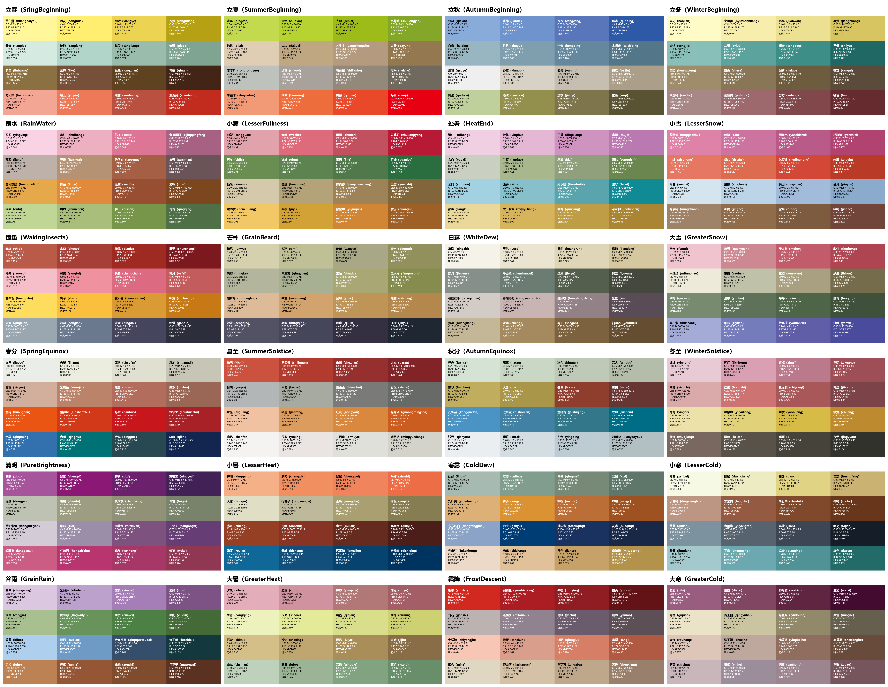

# 1. 说明


根据《中国传统色：故宫里的色彩美学》一书，将书中的色彩翻译成前端代码 。

## 1.1. 关于颜色名

因为原书中所有颜色的命名非常文艺，不好翻译，至少我不认为我有能力去翻译。 



所以所有颜色全部写成汉语拼音。

不过，节气名参照中国气象局的翻译 <sup id="a0"><a href="#f0">注0</a></sup>（略有修改）。

| 中文 | 中国气象局翻译 | 变量名 |
| --- | --- | --- |
| 立春 | the Beginning of Spring | SringBeginning |
| 雨水 | Rain Water | RainWater |
| 惊蛰 | the Waking of Insects | WakingInsects |
| 春分 | the Spring Equinox | SpringEquinox |
| 清明 | Pure Brightness | PureBrightness |
| 谷雨 | Grain Rain | GrainRain |
| 立夏 | the Beginning of Summer | SummerBeginning  |
| 小满 | Lesser Fullness of Grain | LesserFullness |
| 芒种 | Grain in Beard | GrainBeard |
| 夏至 | the Summer Solstice | SummerSolstice |
| 小暑 | Lesser Heat | LesserHeat |
| 大暑 | Greater Heat | GreaterHeat |
| 立秋 | the Beginning of Autumn | AutumnBeginning |
| 处暑 | the End of Heat | HeatEnd |
| 白露 | White Dew | WhiteDew |
| 秋分 | the Autumn Equinox | AutumnEquinox |
| 寒露 | Cold Dew | ColdDew |
| 霜降 | Frost's Descent | FrostDescent |
| 立冬 | the Beginning of Winter | WinterBeginning |
| 小雪 | Lesser Snow | LesserSnow |
| 大雪 | Greater Snow | GreaterSnow |
| 冬至 | the Winter Solstice | WinterSolstice |
| 小寒 | Lesser Cold | LesserCold |
| 大寒 | Greater Cold | GreaterCold |

同时，为了避免颜色名同音，加上了节气的名称。   
再加上`CTC` 命名空间（前缀），构成完整的名称。  
CTC 即 **C**hinese **T**radtional **C**olor 的缩写。

CSS 的格式：`--CTC_节气_颜色名`

例：
```
--CTC_AutumnBeginning_qunqing
```

JS 的格式如：`CTC.节气.颜色名`

例：
```
CTC.AutumnBeginning.qunqing
```

### 1.1.1. 关于拼音

#### 1.1.1.1. 多音字

多音字的读音选择参考如下

| 多音字 | 涉及词汇 | 拼音 | 参考来源 |
| --- | --- | --- | --- |
| 曾 | 曾青 | cénɡ qīnɡ | [https://www.zysj.com.cn/zhongyaocai/cengqing/index.html#ci417570](https://www.zysj.com.cn/zhongyaocai/cengqing/index.html#ci417570) |
| 壳 | 栗壳 | lì ké | - |

#### 1.1.1.2. 生僻字

因为采用了拼音，而原书中有一些生僻字，这里将我认为的生僻字一级读音列出，供参考

| 生僻字 | 涉及词汇 | 拼音 | 参考来源 |
| --- | --- | --- | --- |
| 缃 | 缃叶 | xiāng yè | [缃叶](https://www.zdic.net/hans/缃叶) |
| 缊、韨 | 缊韨 | wēn fú | [缊韨](https://www.zdic.net/hans/缊韨) |
| 綪、茷 | 綪茷 | qiàn fá | [綪茷](https://www.zdic.net/hans/綪茷) |
| 籥 | 夏籥 | xià yuè | [夏籥](https://www.zdic.net/hans/夏籥) |
| 雘 | 丹雘<br />青雘 | dān wò<br />qīng wò | [丹雘](https://www.zdic.net/hans/丹雘)<br />[青雘](https://www.zdic.net/hans/青雘) |
| 緺 | 青緺 | qīng guā | [青緺](https://www.zdic.net/hans/青緺) |
| 赪 | 赪紫<br />赪霞<br />赪尾 | chēng zǐ<br />chēng xiá<br />chēng wěi | [赪](https://www.zdic.net/hans/赪) |
| 茈 | 茈藐 | zǐ miǎo | [茈](https://www.zdic.net/hans/茈) |
| 紶 | 紫紶 | zǐ qū | [紶](https://www.zdic.net/hans/紶) |
| 緅、絺 | 緅絺 | zōu chī | [緅](https://www.zdic.net/hans/緅)、[絺](https://www.zdic.net/hans/絺) |
| 罽 | 丹罽 | dān jì | [罽](https://www.zdic.net/hans/罽) |
| 芰 | 芰荷 | jì hé | [芰荷](https://www.zdic.net/hans/芰荷) |
| 埒 | 金埒 | jīn liè | [金埒](https://www.zdic.net/hans/金埒) |
| 䒌、靘 | 䒌靘 | mìng qìng | [䒌](https://www.zdic.net/hans/䒌)<br />[靘](https://www.zdic.net/hans/靘) |
| 璆 | 璆琳 | qiú lín | [璆琳](https://www.zdic.net/hans/璆琳) |
| 赩 | 赩炽 | xì chì | [赩炽](https://www.zdic.net/hans/赩炽) |
| 繎 | 大繎 | dà rán | [繎](https://www.zdic.net/hans/繎) |
| 頩 | 玉頩 | yù pīng | [頩](https://www.zdic.net/hans/頩) |
| 骍 | 骍刚 | xīng gāng | [骍刚](https://www.zdic.net/hans/骍刚) |
| 荩、箧 | 荩箧 | jìn qiè | [荩箧](https://www.zdic.net/hans/荩箧) |
| 秫 | 丹秫 | dān shú | [丹秫](https://www.zdic.net/hans/丹秫) |
| 藘 | 茹藘 | rú lǘ | [茹藘](https://www.zdic.net/hans/茹藘) |
|  |  |  |  |
|  |  |  |  |
|  |  |  |  |
|  |  |  |  |
|  |  |  |  |
|  |  |  |  |
|  |  |  |  |
|  |  |  |  |

#### 1.1.1.3. ü

因为 **ü** 不好输入，所以采用国家标准 <sup id="a1"><a href="#f1">注1</a></sup>，采用 **yu** 替代 **ü** 。
即，如“绿”的 **lü** 统一替换为 **lyu** 。

**但次用法仅限于露（lu）、绿（lu）等无法区分的情况，琚（ju）等不会产生歧义的字则不做替换。**

# 2. 安装

## 2.1. 浏览器

想要直接使用 CSS ，直接导入相关的 CSS 文件即可。

```
 <link rel="localization" href="https://gitee.com/undeadway/chinese-traditional-color/raw/master/dist/index.css" />
```

要使用 JS 相关的功能，直接导入相关的 JS 文件即可。

```
<script src="https://gitee.com/undeadway/chinese-traditional-color/raw/master/dist/index.js">
```

## 2.2. npm

1、npm 安装 chinese-traditional-color
```
npm install chinese-traditional-color
```

2、导入相关代码

CSS：
```
import 'chinese-traditional-color/dist/index.css';
```

JS：

```
import CTC from "chinese-traditional-color";
window.CTC = CTC;
```

# 3. 使用

## 3.1. CSS

直接在 html 文件中使用相关名称引用即可。

```
<html>
<div class="demo">abc</div>
<style>
.demo {
	color: var(--CTC_AutumnBeginning_qunqing);
	background:var(--CTC_SringBeginning_huangbaiyou);
}
</style>
</html>
```

### 3.1.1. CMYK

CTC 通过 `device-cmyk` 来支持 CMYK  <sup id="a2"><a href="#f2">注2</a></sup>。  

**所以，在使用 CMYK 模式前，请确认您的系统是否支持 `device-cmyk` 。**

CMYK 则是在普通变量名后面，加入 `-cmyk` 后缀即可。
如：
```
	color: var(--CTC_AutumnBeginning_qunqing-cmyk);
```

## 3.2. JS

所有对象都挂载在 CTC 对象下。  
需要通过 CTC 来引用。

### 3.2.1. 全局对象

#### 3.2.1.1. 说明

全局对象，即 CTC 。

可以直接在代码的任意位置调用 `CTC` 来使用。  
如：

```
<html>
<div id="demo">abc</div>
<script>
dont demo = document.getElementById("demo");
const color = CTC.getColorByName("群青");
const bgColor = CTC.getColorByName("黄白游");
demo.css({
	"color": color.getHexRgb(),
	"background"： bgColor.getHexRgb()
});
</script>
</html>
```

#### 3.2.1.2. API

| API 名称 | 用处 | 参数 | 返回值 |
| --- | --- | --- | --- |
| getColorByName | 获得名称获得颜色对象 | 颜色名称（中、英）<br/>1. 中文名（例：群青）<br/>2. 英语名（例：qunqing） | 颜色的对象实例 |
| getColorMapBySolarTerm | 通过节气的编号或者节气的名称获得某个节气对应的所有颜色 | 参数有以下三种形式：<br/>1. 编号，从 0（立春） 开始<br />2. 中文名（例：立秋）<br />3. 英文名（例：AutumnBeginning） | 颜色对象的集合 |
| getAllSolarTermCnNameList | 返回所有节气的中文名列表 | 无 | 所有节气中文名的数组，顺序为：立春、雨水、惊蛰... |
| getAllSolarTermNameList | 返回所哟节气的英文名列表 | 无 | 所有节气名称（命名空间的名称）的数组，顺序为：SringBeginning、RainWater、WakingInsects... |

#### 3.2.2. 节气对象

节气对象是从 CTC 中获得的对象。  
获得方式如下：

```
const salorTerm = CTC.getSolarTermByName("立秋");
```

##### 3.2.2.1. API

| API 名称 | 作用 | 参数 | 返回值 |
| --- | --- | --- | --- |
| getColorByName | 获得名称获得颜色对象| 颜色名称（中、英）<br/>1. 中文名（例：群青）<br/>2. 英语名（例：qunqing） | 颜色的对象实例 |
| getColorMapByName | 获得当前节气下的所有颜色 | 无 | 颜色对象的集合 |

#### 3.2.3. 颜色对象


节气对象是从 CTC 中获得的对象。  
获得方式如下：

```
const color1 = CTC.getColorByName("群青");
```

也可以是从节气对象中，获得方式如下：

```
const color2 = salorTerm.getColorByName("群青");
```

##### 3.2.3.1. API

| API 名称 | 作用 | 参数 | 返回值 |
| --- | --- | --- | --- |
| getCnName | 获得颜色的中文名 | 无 | 颜色的中文名（例：群青） |
| getName | 获得颜色的英文名 | 无 | 颜色的中文名（例：qunqing） |
| getRgb | 获得 RGB 值 | 无 | { r: 46, g: 89, b: 167 } |
| getCmyk | 获得 CMYK 值 | 无 | { c: 85, y: 65, m: 0, k: 0 } |
| getHexRgb | 获得 16进制数形式的 RGB 值 | 无 | #2E59A7 |

# 参考资料

<span id="f0"><a href="#a0">注0</a></span>：[24节气中英文对照](https://www.cma.gov.cn/2011xzt/essjqzt/jqhz/jqhz02/201312/t20131213_233952.html)

<span id="f1"><a href="#a1">注1</a></span>：[中国人名汉语拼音字母拼写规则](http://www.moe.gov.cn/jyb_sjzl/ziliao/A19/201001/t20100115_75609.html)<br />　　 [“吕”字有了正式英文名“LYU”](http://edu.sina.com.cn/en/2012-10-11/094569768.shtml)

<span id="f2"><a href="#a2">注2</a></span>：[https://developer.mozilla.org/zh-CN/docs/Web/CSS/color_value/device-cmyk](https://developer.mozilla.org/zh-CN/docs/Web/CSS/color_value/device-cmyk)

